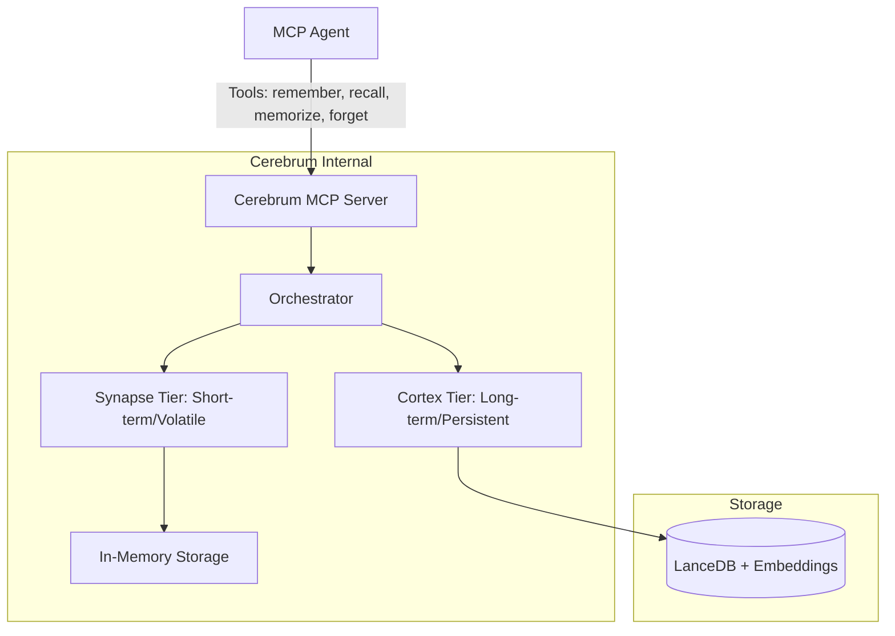
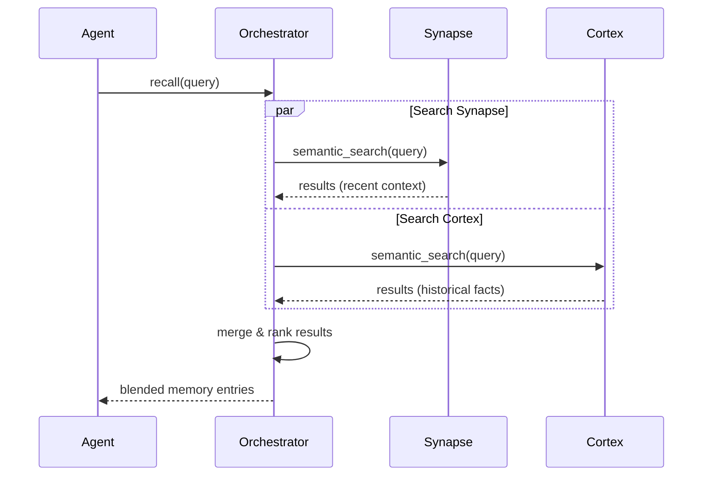

# Cerebrum Architecture

## System Overview

Cerebrum is a two-tier agent memory subsystem implemented as a single Model Context Protocol (MCP) server. It provides agents with both short-term, volatile memory and long-term, persistent memory through a unified tool interface.



## Memory Tiers

### 1. Synapse (Short-term)
- **Nature:** Volatile, in-memory.
- **Scope:** Per-session/interaction context.
- **Lifecycle:** Cleared when the session ends or if manually purged.
- **Purpose:** Rapid retrieval of recent conversation context and immediate task details.

### 2. Cortex (Long-term)
- **Nature:** Persistent, disk-backed.
- **Scope:** Cross-session/global persistence.
- **Implementation:** LanceDB using vector embeddings for semantic search.
- **Lifecycle:** Durable; survives server restarts.
- **Purpose:** Long-term facts, user preferences, and historical context.

## Core Workflow: The Recall Process

When an agent calls `recall`, the Orchestrator performs a blended search across both tiers.



## Core Domain Model

### MemoryEntry

Each memory is represented as a `MemoryEntry` with the following fields:

- **`id: MemoryId`** — Unique UUID-based identifier for the memory.
- **`content: String`** — The text content of the memory.
- **`metadata: HashMap<String, String>`** — Arbitrary key-value metadata (e.g., source, tags).
- **`timestamp: DateTime<Utc>`** — When the memory was created.
- **`salience: f32`** — Importance score (0.0–1.0) used for ranking and promotion decisions.
  - Default: 0.5
  - Clamped to [0.0, 1.0] range
  - Higher values indicate more important memories
- **`tier: MemoryTier`** — Which tier the memory currently resides in (Synapse or Cortex).
- **`embedding: Option<Vec<f32>>`** — Cached 384-dimensional embedding vector for semantic search.
  - Generated using MockEmbedder (development) or FastembedEmbedder (production)
  - Optional to support lazy embedding (compute on demand during storage)
- **`source_session_id: Option<String>`** — Session ID where the memory originated (if applicable).

### MemoryTier Enum

Designates which tier a memory entry resides in:

```rust
pub enum MemoryTier {
    Synapse,  // Short-term, volatile, in-memory
    Cortex,   // Long-term, persistent, vector-backed
}
```

### Embedding Strategy

**Current (Development):** `MockEmbedder`
- Generates deterministic 384-dimensional embeddings based on text hashing
- Suitable for development and testing
- Normalized to unit length for consistent similarity calculations

**Future (Production):** `FastembedEmbedder`
- Uses the `fastembed` crate with BGE-small model
- Produces semantic embeddings (384-dimensional)
- Requires TLS configuration for binary downloads
- Provides higher-quality semantic similarity than hash-based embeddings

### Data Flow: Text → Embedding → Storage


### Builder Pattern

`MemoryEntry` uses a fluent builder pattern for convenient construction:

```rust
let entry = MemoryEntry::builder(id, content)
    .salience(0.8)
    .tier(MemoryTier::Cortex)
    .embedding(embedding_vector)
    .source_session_id("session-123".to_string())
    .metadata("key".to_string(), "value".to_string())
    .timestamp(custom_timestamp)
    .build();
```

### Traits

**`Embedder`** — Async trait for text-to-vector embedding:
```rust
#[async_trait]
pub trait Embedder: Send + Sync {
    async fn embed(&self, text: &str) -> Result<Vec<f32>>;
}
```

**`MemoryStore`** — Async trait for memory storage operations:
```rust
#[async_trait]
pub trait MemoryStore: Send + Sync {
    async fn store(&self, entry: MemoryEntry) -> Result<()>;
    async fn retrieve(&self, query: &str, limit: usize) -> Result<Vec<MemoryEntry>>;
    async fn delete(&self, id: &MemoryId) -> Result<()>;
}
```

## Code Quality

- **Test Coverage:** 100% on core library code (cerebrum-core)
- **Unit Tests:** 11 tests covering embedder, utilities, and models
- **Integration Tests:** 20 tests covering end-to-end workflows
- **Code Quality Gates:**
  - `cargo fmt` — Code formatting
  - `cargo clippy -- -D warnings` — Linting (no warnings allowed)
  - `cargo tarpaulin` — Coverage verification (≥90% required)

