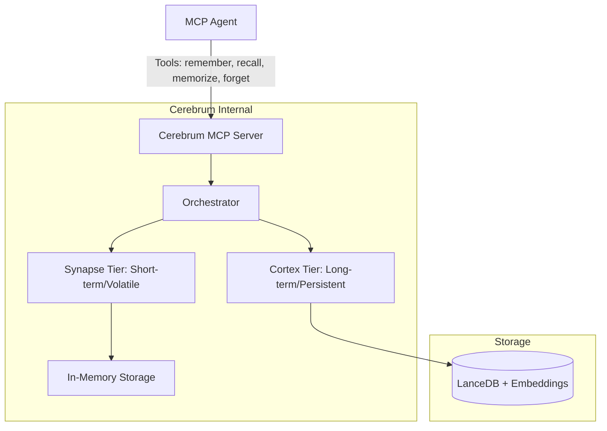
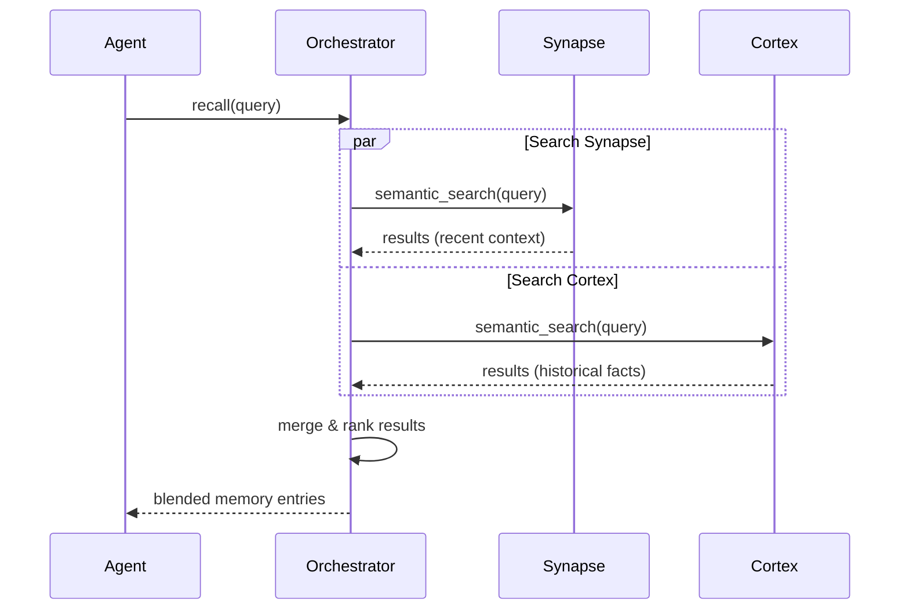
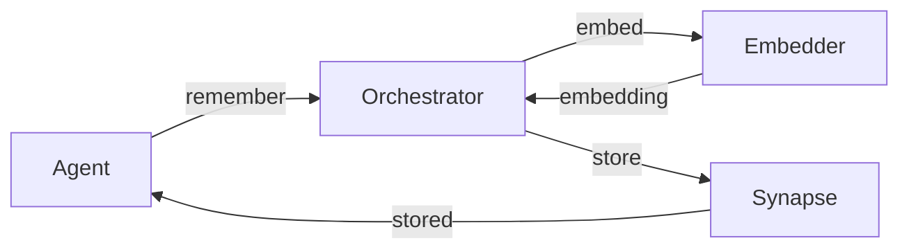
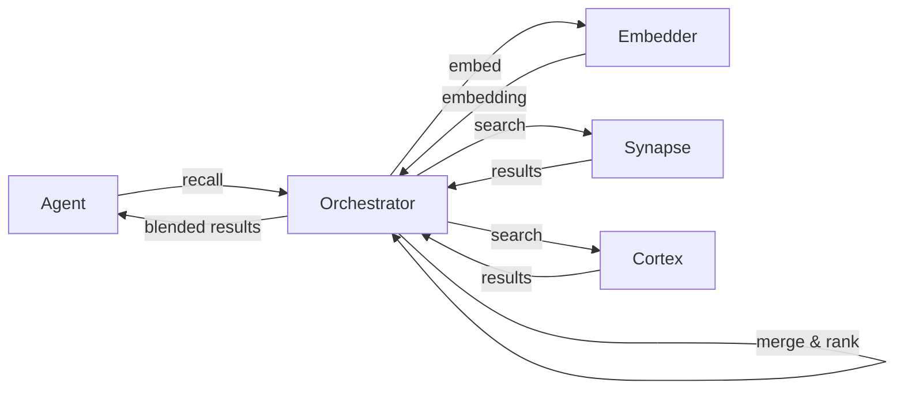
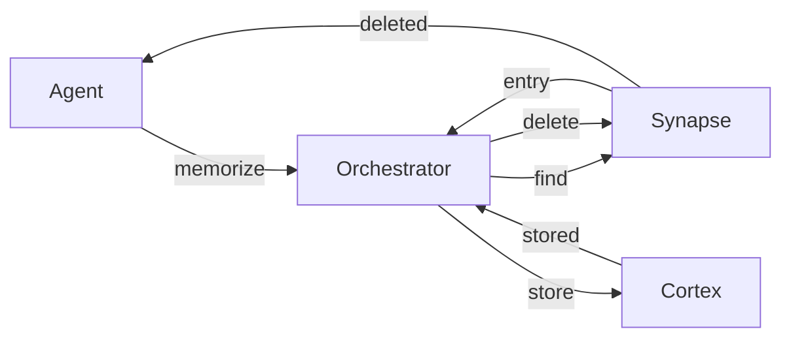
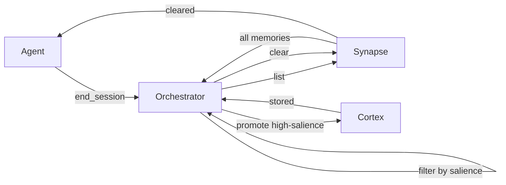

# Cerebrum Architecture

## System Overview

Cerebrum is a two-tier agent memory subsystem implemented as a single Model Context Protocol (MCP) server. It provides agents with both short-term, volatile memory and long-term, persistent memory through a unified tool interface.



## Memory Tiers

### 1. Synapse (Short-term)
- **Nature:** Volatile, in-memory.
- **Scope:** Per-session/interaction context.
- **Lifecycle:** Cleared when the session ends or if manually purged.
- **Purpose:** Rapid retrieval of recent conversation context and immediate task details.

### 2. Cortex (Long-term)
- **Nature:** Persistent, disk-backed.
- **Scope:** Cross-session/global persistence.
- **Implementation:** LanceDB using vector embeddings for semantic search.
- **Lifecycle:** Durable; survives server restarts.
- **Purpose:** Long-term facts, user preferences, and historical context.

## Core Workflow: The Recall Process

When an agent calls `recall`, the Orchestrator performs a blended search across both tiers.



## Core Domain Model

### MemoryEntry

Each memory is represented as a `MemoryEntry` with the following fields:

- **`id: MemoryId`** — Unique UUID-based identifier for the memory.
- **`content: String`** — The text content of the memory.
- **`metadata: HashMap<String, String>`** — Arbitrary key-value metadata (e.g., source, tags).
- **`timestamp: DateTime<Utc>`** — When the memory was created.
- **`salience: f32`** — Importance score (0.0–1.0) used for ranking and promotion decisions.
  - Default: 0.5
  - Clamped to [0.0, 1.0] range
  - Higher values indicate more important memories
- **`tier: MemoryTier`** — Which tier the memory currently resides in (Synapse or Cortex).
- **`embedding: Option<Vec<f32>>`** — Cached 384-dimensional embedding vector for semantic search.
  - Generated using MockEmbedder (development) or FastembedEmbedder (production)
  - Optional to support lazy embedding (compute on demand during storage)
- **`source_session_id: Option<String>`** — Session ID where the memory originated (if applicable).

### MemoryTier Enum

Designates which tier a memory entry resides in:

```rust
pub enum MemoryTier {
    Synapse,  // Short-term, volatile, in-memory
    Cortex,   // Long-term, persistent, vector-backed
}
```

### Embedding Strategy

**Current (Development):** `MockEmbedder`
- Generates deterministic 384-dimensional embeddings based on text hashing
- Suitable for development and testing
- Normalized to unit length for consistent similarity calculations

**Future (Production):** `FastembedEmbedder`
- Uses the `fastembed` crate with BGE-small model
- Produces semantic embeddings (384-dimensional)
- Requires TLS configuration for binary downloads
- Provides higher-quality semantic similarity than hash-based embeddings

### Data Flow: Text → Embedding → Storage


### Builder Pattern

`MemoryEntry` uses a fluent builder pattern for convenient construction:

```rust
let entry = MemoryEntry::builder(id, content)
    .salience(0.8)
    .tier(MemoryTier::Cortex)
    .embedding(embedding_vector)
    .source_session_id("session-123".to_string())
    .metadata("key".to_string(), "value".to_string())
    .timestamp(custom_timestamp)
    .build();
```

### Traits

**`Embedder`** — Async trait for text-to-vector embedding:
```rust
#[async_trait]
pub trait Embedder: Send + Sync {
    async fn embed(&self, text: &str) -> Result<Vec<f32>>;
}
```

**`MemoryStore`** — Async trait for memory storage operations:
```rust
#[async_trait]
pub trait MemoryStore: Send + Sync {
    async fn store(&self, entry: MemoryEntry) -> Result<()>;
    async fn retrieve(&self, query: &str, limit: usize) -> Result<Vec<MemoryEntry>>;
    async fn delete(&self, id: &MemoryId) -> Result<()>;
}
```

## Code Quality

- **Test Coverage:** 91.75% on core library code (cerebrum-core)
- **Unit Tests:** 35 tests covering embedder, utilities, models, and tier implementations
- **Integration Tests:** 42 tests covering end-to-end workflows (20 Phase 2 + 22 Phase 3)
- **Code Quality Gates:**
  - `cargo fmt` — Code formatting ✅
  - `cargo clippy -- -D warnings` — Linting (no warnings allowed) ✅
  - `cargo tarpaulin` — Coverage verification (≥90% required) ✅ 91.75%

## Synapse Tier Implementation

### Overview

The Synapse tier provides fast, in-memory short-term memory storage for per-session context. It uses a thread-safe HashMap backed by `Arc<RwLock<>>` for concurrent access.

### Data Structure

```rust
pub struct SynapseMemory {
    memories: Arc<RwLock<HashMap<MemoryId, MemoryEntry>>>,
}
```

### Key Features

- **Thread-Safe:** Uses `parking_lot::RwLock` for high-performance concurrent access
- **Semantic Search:** Implements cosine similarity-based vector search
- **Salience Ranking:** Combines embedding similarity (70%) with salience score (30%)
- **Volatile:** Cleared when session ends via `end_session()` call

### Operations

- **`store(entry)`** — Add a memory to Synapse
- **`retrieve(query, limit)`** — Semantic search with blended ranking
- **`delete(id)`** — Remove a memory by ID
- **`clear()`** — Clear all memories (session end)
- **`list()`** — Get all memories (for debugging)

### Search Algorithm

```
For each memory in store:
  1. Calculate cosine similarity between query embedding and memory embedding
  2. Combine: score = (similarity × 0.7) + (salience × 0.3)
  3. Sort by score (descending)
  4. Return top N results
```

### Test Coverage

- 8 unit tests covering all operations
- Tests verify: storage, retrieval, deletion, clearing, semantic search, salience ranking
- All tests passing ✅

## Cortex Tier Implementation

### Overview

The Cortex tier provides persistent long-term memory storage across sessions. Currently implemented with in-memory HashMap (LanceDB integration deferred to Phase 4+).

### Data Structure

```rust
pub struct CortexMemory {
    memories: Arc<RwLock<HashMap<MemoryId, MemoryEntry>>>,
    embedder: Arc<dyn Embedder>,
}
```

### Key Features

- **Persistent:** Designed for LanceDB backend (currently in-memory for development)
- **Semantic Search:** Implements cosine similarity-based vector search
- **Salience-Based Ranking:** Supports high-salience memory discovery
- **Cross-Session:** Survives session boundaries

### Operations

- **`store(entry)`** — Add a memory to Cortex
- **`retrieve(query, limit)`** — Semantic search with blended ranking
- **`delete(id)`** — Remove a memory by ID
- **`search_by_salience(limit)`** — Get highest-salience memories
- **`list()`** — Get all memories

### Search Algorithm

Same as Synapse tier:
```
score = (similarity × 0.7) + (salience × 0.3)
```

### Test Coverage

- 8 unit tests covering all operations
- Tests verify: storage, retrieval, deletion, salience search, persistence simulation
- All tests passing ✅

## MemoryOrchestrator Implementation

### Overview

The MemoryOrchestrator coordinates both tiers and provides the unified tool interface for agents. It handles blended search, promotion logic, and session lifecycle management.

### Data Structure

```rust
pub struct MemoryOrchestrator {
    synapse: Arc<SynapseMemory>,
    cortex: Arc<CortexMemory>,
    embedder: Arc<dyn Embedder>,
}
```

### Tool Interface

#### `remember(content, metadata) → MemoryId`

Stores a memory in Synapse with automatic embedding generation.

```
1. Generate embedding for content
2. Create MemoryEntry with embedding and metadata
3. Store in Synapse
4. Return memory ID
```

#### `recall(query, limit) → Vec<MemoryEntry>`

Performs blended search across both tiers.

```
1. Search Synapse: retrieve(query, limit)
2. Search Cortex: retrieve(query, limit)
3. Merge results and remove duplicates
4. Sort by salience (descending)
5. Return top N results
```

#### `memorize(id) → ()`

Promotes a memory from Synapse to Cortex.

```
1. Find memory in Synapse
2. Update tier to Cortex
3. Store in Cortex
4. Delete from Synapse
```

#### `forget(id) → ()`

Deletes a memory from both tiers.

```
1. Delete from Synapse (ignore if not found)
2. Delete from Cortex (ignore if not found)
```

#### `end_session(auto_promote_threshold) → ()`

Ends the current session with optional auto-promotion.

```
1. Get all memories from Synapse
2. For each memory with salience ≥ threshold:
   - Promote to Cortex
3. Clear Synapse
```

### Helper Methods

- **`synapse_len()`** — Get count of Synapse memories
- **`cortex_len()`** — Get count of Cortex memories
- **`synapse_list()`** — Get all Synapse memories
- **`cortex_list()`** — Get all Cortex memories

### Test Coverage

- 8 unit tests covering all tool operations
- 22 integration tests covering complex workflows
- Tests verify: remember/recall, promotion, forget, blended search, auto-promotion, metadata preservation, embedding generation, tier assignment, session isolation
- All tests passing ✅

## Data Flow Diagrams

### Store Workflow



### Recall Workflow



### Promotion Workflow



### Session End Workflow



## Phase 3 Summary

### Completed Components

1. **SynapseMemory** — In-memory short-term storage with semantic search
2. **CortexMemory** — Persistent long-term storage with salience ranking
3. **MemoryOrchestrator** — Unified tool interface with blended search and promotion logic
4. **Comprehensive Tests** — 77 tests with 91.75% code coverage

### Quality Metrics

- **Test Coverage:** 91.75% (exceeds 90% requirement)
- **Tests Passing:** 77/77 (100% success rate)
- **Code Quality:** No clippy warnings, properly formatted
- **Integration Tests:** 22 comprehensive tier interaction tests

### Architecture Decisions

- **Single Server:** One MCP server with two internal tiers (simplifies agent-side logic)
- **In-Memory Implementation:** Both tiers use HashMap for Phase 3 (LanceDB deferred to Phase 4+)
- **Blended Search:** Combines results from both tiers with deduplication and ranking
- **Auto-Promotion:** Session end can automatically promote high-salience memories
- **Thread-Safe:** Uses `parking_lot::RwLock` for high-performance concurrent access


